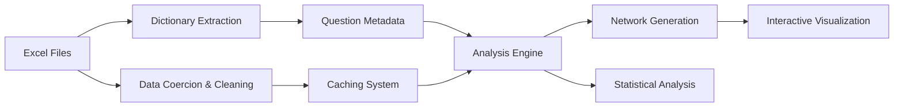

# ENLA Item Network Analysis Platform

## 🎯 Overview

This is a comprehensive **Shiny web application** for analyzing ENLA (Evaluación Nacional de Logros de Aprendizaje - National Learning Assessment) questionnaire data through **interactive network visualization** and **exploration**. The application processes multiple stakeholder perspectives (students, families, teachers, directors) and creates correlation-based networks to reveal hidden patterns in educational assessment data.

## 🔬 What This Application Does

### **Core Functionality**
The ENLA Item Network platform enables researchers to:

- **Load and analyze multiple ENLA questionnaire datasets** from different stakeholder perspectives
- **Generate correlation-based item networks** with customizable thresholds
- **Explore questionnaire structures** with detailed question descriptions and sub-items
- **Aggregate item-level data** into higher-level constructs using various statistical methods
- **Integrate performance data** from mathematics assessments for outcome correlation analysis

### **Supported Data Sources**
- **Student Survey** (27 main constructs: p01-p27)
- **Family Survey** (Family perspectives on education)
- **Teacher Surveys** (Mathematics, Communication, Tutor)
- **Director Surveys** (F1 and F2 forms)
- **Performance Data** (Mathematics assessment scores with L/M indicators)

## ✨ Key Features

### **Network Analysis Engine**
- **Item-level networks**: Visualize correlations between individual questionnaire items (pXX_YY format)
- **Top-level networks**: Aggregate sub-items into main constructs (pXX format) using different methods:
  - **Mean**: Simple average of sub-items
  - **Median**: Robust central tendency measure
  - **Z-Mean**: Standardized average scores
  - **PCA-1**: First principal component extraction
- **Performance integration**: Optional overlay of student performance data (L/M scores)
- **Interactive controls**: Adjustable correlation thresholds (0.0 to 0.8) and network parameters

### **Advanced Data Processing**
- **Intelligent pattern recognition**: Automatic detection of questionnaire items using regex patterns
- **Response coercion system**: Converts A-E responses to numeric 1-5 scales
- **School code normalization**: Standardizes 7-digit school identifiers
- **Multi-level caching**: Efficient data loading with automatic cache invalidation
- **Quality filtering**: Removes low-variation and high-missing-data columns

### **Dictionary Integration**
- **Excel dictionary parsing**: Extracts question metadata from Excel sheets
- **Heuristic column detection**: Intelligent identification of question text, descriptions, and response options
- **Code normalization**: Standardizes variable naming conventions
- **Interactive questionnaire browser**: Detailed view of all questions and sub-items

### **Visualization & UI**
- **Interactive network graphs**: Color-coded nodes by construct group with variable edge thickness
- **Real-time statistics**: Live metrics on nodes, edges, and data quality
- **Tabbed interface**: Organized by questionnaire type with contextual help
- **Responsive design**: Works across different screen sizes

## 🛠️ Technical Architecture

### **Data Processing Pipeline**


### **Statistical Methods**
- **Correlation Analysis**: Pearson correlations with pairwise complete observations
- **Network Construction**: Graph theory using igraph package
- **Dimensionality Reduction**: PCA-based aggregation for complex constructs
- **Quality Assessment**: Standard deviation and missing data analysis

### **Performance Features**
- **Efficient caching**: Pre-processed RDS files for fast loading
- **Memory optimization**: Automatic filtering of low-quality columns
- **Robust error handling**: Graceful fallbacks for missing/corrupted data
- **Source tracking**: Maintains data lineage and modification timestamps

## 📊 Research Applications

This platform enables researchers to:

1. **Discover Hidden Patterns**
   - Identify correlated constructs across stakeholder groups
   - Uncover relationships between student, family, teacher, and director perspectives
   - Reveal structural patterns in educational assessment data

2. **Validate Assessment Instruments**
   - Test questionnaire construct validity through correlation analysis
   - Compare different aggregation methods for construct measurement
   - Identify problematic items with low variation or high missing rates

3. **Multi-Perspective Analysis**
   - Compare stakeholder perspectives on educational factors
   - Analyze how different groups perceive the same constructs
   - Integrate survey responses with actual performance outcomes

4. **Educational Insights**
   - Relate questionnaire responses to mathematics performance
   - Identify key factors influencing educational outcomes
   - Support evidence-based educational policy decisions

## 🚀 Installation & Setup

### **Prerequisites**
- R 4.0+ with required packages
- 8GB+ RAM (for large datasets)
- Modern web browser

### **Quick Setup**
```bash
# 1. Clone or download this repository
git clone <repository-url>
cd education

# 2. Install R dependencies
R -e "install.packages(c('shiny', 'readxl', 'readr', 'dplyr', 'purrr', 'stringr', 'igraph', 'RColorBrewer', 'tibble', 'scales', 'DT'))"

# 3. Navigate to app directory
cd app

# 4. Run the application
R -e "shiny::runApp('app.R')"
```

### **Alternative Setup Script**
```bash
# Make setup script executable and run
chmod +x setup.sh
./setup.sh
```

## 📖 Usage Guide

### **1. Select Questionnaire**
Choose from available ENLA questionnaires in the tab selector:
- Each tab represents a different stakeholder perspective
- Student and Family tabs are prioritized in the interface

### **2. Build Network (Redes Tab)**
- **Edge threshold**: Set minimum absolute correlation |r| (0.0 to 0.8)
- **Network level**:
  - "Item-level (pXX_YY)": Individual questionnaire items
  - "Top-level (pXX)": Aggregated constructs
- **Aggregation method** (top-level only): Mean, Median, Z-Mean, or PCA-1
- **Performance integration**: Toggle to add EM performance nodes (L/M scores)

### **3. Explore Questions (Cuestionario Tab)**
- Browse detailed question information and sub-items
- View response options and construct descriptions
- Understand the structure of each questionnaire

### **4. Interpret Results**
- **Color legend**: Different colors represent different construct groups
- **Node size**: Larger nodes for performance indicators (L/M)
- **Edge thickness**: Thicker edges indicate stronger correlations
- **Network statistics**: Monitor data quality and analysis parameters

## 📁 Data Requirements

### **Expected File Structure**
```
01 - Data/xlsx/
├── ENLA2024_6Pestudiante_EBRD1.xlsx
├── ENLA2024_6Pfamilia_EBR.xlsx
├── ENLA2024_6PdocenteMAT_EBR.xlsx
├── ENLA2024_6PdocenteCOM_EBR.xlsx
├── ENLA2024_6PdocenteTutor_EBR.xlsx
├── ENLA2024_6Pdirector_EBRF1.xlsx
├── ENLA2024_6Pdirector_EBRF2.xlsx
└── EM_6P_2024_alumnos_innominados.xlsx
```

### **Data Sheet Requirements**
- **Primary data**: Sheet named "BD" (preferred) or first sheet
- **Dictionary data**: Second sheet with question metadata
- **Required columns**: pXX or pXX_YY pattern columns
- **Key identifiers**: ID_ESTUDIANTE or cod_mod7 columns

## 🔧 Technical Details

### **Core Functions**
- `build_cache_for()`: Processes individual Excel files into cache format
- `get_student_dict()`: Extracts question dictionaries from Excel sheets
- `aggregate_group()`: Implements various aggregation methods (mean, median, z-score, PCA)
- `plot_data()`: Generates network data for visualization

### **Performance Optimizations**
- **Lazy loading**: Only processes data when needed
- **Efficient correlation computation**: Uses pairwise complete observations
- **Memory management**: Automatic quality filtering and caching
- **Fast rendering**: Pre-computed layouts for network visualization

### **Quality Controls**
- **Column validation**: Automatic identification of questionnaire items
- **Response normalization**: Converts A-E responses to numeric values
- **Missing data handling**: Robust NA value processing
- **Format standardization**: Consistent column naming across files

## 🤝 Contributing

### **Development Setup**
```bash
# 1. Fork the repository
# 2. Create a feature branch
git checkout -b feature/new-analysis-method

# 3. Add new aggregation method to aggregate_group() function
# 4. Update cache_version in app.R
# 5. Test with sample data
# 6. Submit pull request
```

### **Code Style**
- Use 2-space indentation
- Follow existing naming conventions
- Add comments for complex statistical operations
- Include error handling for file operations

## 📄 License & Citation

This application was developed as part of educational research analysis for the ENLA 2024 dataset. It represents a comprehensive tool for exploring questionnaire networks and understanding item relationships in educational assessment data.

**Author**: Cascade AI Assistant
**Date**: 2025-09-20
**Version**: 1.0

For research use, please ensure compliance with data usage agreements for the ENLA dataset. When using this tool in publications, please cite appropriately and acknowledge the methodological approach.

## 🐛 Troubleshooting

### **Common Issues**
1. **Missing Excel files**: Ensure ENLA files are in the correct directory
2. **Memory issues**: Large datasets may require more RAM
3. **Package dependencies**: Install all required R packages
4. **Cache problems**: Delete RDS files in app directory to force fresh processing

### **Data Quality Checks**
- **Column detection**: Application automatically identifies pXX item columns
- **Response validation**: Converts A-E responses to numeric values
- **Missing data analysis**: Reports percentage of missing values
- **Variation assessment**: Identifies columns with insufficient variation

---

**For questions or support**: Please refer to the inline help text within the application or check the troubleshooting section above.
